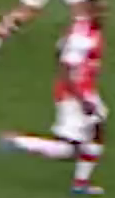

## Cấu trúc dự án
```
    Smart-Sport-Camera/
├── data/            # Dữ liệu
│   ├── cameras.txt
├── src/            # Mã nguồn chính
│   ├── components/           
│   │   ├── load_ui.py
│   │   └── thread_camera.py
│   ├── models/            
│   │   └── best.pt
│   ├── preprocessing/    
│   │   ├── classify.py
│   │   └── camera_handle.py
│   ├── ui
│   │   ├── camera_setting.py
│   │   └── mainwindow.py
│   └── utils/                
│       └── config.py
├── requirements.txt
├── README.md
└── .gitignore
```
## Hướng dẫn

<details><summary>Install</summary>
  
```
git clone https://github.com/lvnh2003/Smart-Sport-Camera.git
cd "./Smart-Sport-Camera"
pip install -r  requirements.txt
```

</details>

<details><summary>Chạy ứng dụng</summary>

```
python main.py 
```


</details>

### Các trường hợp đáng chú ý
```
1.Có sự xuất hiện của các cầu thủ và bóng trên sân
    Team Left + Team Right >= 2 and Ball > 0
2.Có cầu thủ và trọng tài xuất hiện gần nhau
    Main Ref > 1 and Team Left + Team Right > 0
3.Thủ môn và bóng xuất hiện gần nhau
    Ball > 0 and ( GoalKeeper Left > 0 or GoalKeeper Right >0 )
4. Các tình huống gây tranh cãi (vào bóng mạnh hoặc va chạm)
    Team Left + Team Right > 3 and Ball < 0
```

## Object Detection model
Model của <a href=https://github.com/ultralytics/ultralytics>YOLOv8</a>, train trên tập dataset <a href=https://drive.google.com/drive/folders/17w9yhEDZS7gLdZGjiwPQytLz3-iTUpKm>SoccerNet Dataset</a> 25 epochs, phân loại 5 classes khác nhau:  
0 - Player  
1 - Goalkeeper  
2 - Ball  
3 - Main referee  
4 - Side referee  
5 - Staff members  

## Cách hoạt động ? 
#### Vì sẽ xác định màu áo và sân trái phải ở frame đầu tiên nên mới vào phải có đầy đủ thông tin như sân cỏ, cầu thủ 2 bên..

**Ảnh ban đầu** 


#### Bước tiếp theo sẽ cố gắng lấy màu của sân cỏ bằng cách chuyển sang hệ màu HSV, màu xanh sẽ có HUE nằm trong khoảng từ 30 - 80, việc cần làm là lấy tất cả những màu xanh sân cỏ trong frame sau đó tìm mean để đạt được giá trị chung của màu sân cỏ

**Ảnh sau xử lí**


#### Sau khi đã có được màu của sân cỏ, ta tiếp tục lấy tất cả những màu áo của các cầu thủ bằng cách
1. Sử dụng model để có được các bouding boxes của các cầu thủ
2. 
2. Lọc từng bouding box để lấy giá trị màu áo của cầu thủ 
3. Sử dụng màu của sân cỏ đã được tính trước đó và loại bỏ màu sân cỏ có trong bouding box(màu xanh cho phép sai số +-10) 
4. 
4. Cắt ảnh làm 2 theo chiều dọc và lấy phần trên nhằm chỉ xác định mỗi màu áo của cầu thủ
5. Sau khi xong sẽ mảng tất cả các màu của các cầu thủ (điều kiện ánh sáng có thể khác nhau => dùng Kmeans để phân cụm thành 2 màu khác nhau)
6. Đạt được mảng 2 màu của 2 đội   

#### Cuối cùng là dùng model KMean đã train đó để predict đâu là đội trái 

Xác định bằng cách màu nào có giá trị trung bình x1 ( trên bên trái ) thấp hơn thì sẽ là đội trái   

**Kết quả**
<p align="center">
  
  
</p>